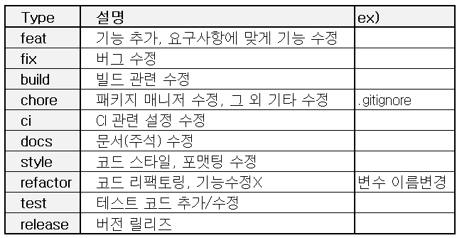
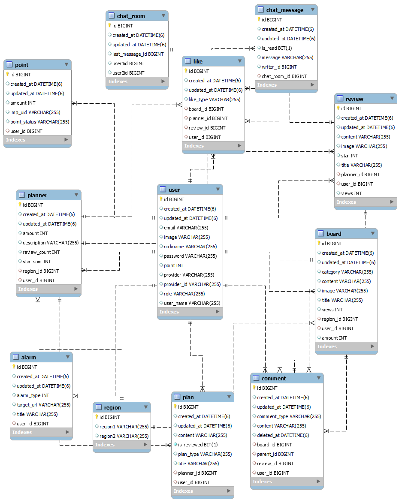

### Team Project

# 
 AirPlanning ✈️

#### 
 <h4> 여행 플래너가 1:1 맞춤으로 계획을 세워주는 SNS입니다. 

 <a href="http://ec2-52-79-82-151.ap-northeast-2.compute.amazonaws.com:8085/">바로가기</a> 

[📌 서비스 UI](http://ec2-52-79-82-151.ap-northeast-2.compute.amazonaws.com:8085/)  
[📌 노션 프로젝트 페이지](https://descriptive-soda-58f.notion.site/4-Air-Planning-99a0eaa0d3584b969cffc3128a83e0a5)  
[📌 Swagger-ui](http://ec2-13-124-105-0.ap-northeast-2.compute.amazonaws.com:8081/swagger-ui/)

## Index
- [프로젝트의 목적 및 용도](목적과용도)
- [개발환경](#개발환경)
- [ERD](#erd)
- [Swagger](#-swagger-)
- [API EndPoint](#-api-endpoint-)

### 🚩 프로젝트의 목적 및 용도

- 이 프로젝트는 무엇을 위한 것인가?  
  -> 코로나가 조금 안정이 되며 22년 국내여행 횟수가 전년 대비 17.3% 증가하고, 여행 정보를 과거 방문 경험, 주변인, 인터넷 사이트/모바일 앱 등의 순으로 획득함을 확인하며 국내의 대표적인 관광 여행지를 제외한 지역 방문에 대한 경계를 낮추고 관광객을 유치하며 지역 활성화를 도움과 동시에, 계획을 짜기 어려워하는 사용자들에게 다양한 지역의 숨은 명소들을 통해 낯설지만 풍요로운 경험을 찾을 수 있도록 도움을 주기 위해 프로젝트를 기획하였다.
- 어떤 문제를 해결할 수 있는가?  
  - 문제1. 여행사를 통한 경우 짜여져 있는 플랜으로 개인 맞춘 상세한 플랜 조절이 불가능하다.
  - 문제2. 과거 방문 경험에 의해 여행지를 선택 할 경우 과거와 비슷한 경험에 머무를 가능성이 높다.
  - 문제3. 인터넷사이트/모바일 앱을 통해 정보를 획득하는 경우 홍보게시물을 추려내기 어렵다.  

  -> Air-Planning은 사용자가 등록되어있는 포트폴리오를 확인후 플래너를 선택할 수 있고, 플래너와 1:1 채팅을 통해 개인의 취향과 요청사항에 맞추어 플랜 조율이 가능하므로 새로운 여행지에서 취향에 맞는 다양한 경험을 통해 여행의 만족도를 높여 위의 대표적인 문제가 되었던 사례들을 해결할 수 있을 것으로 예상된다.
- 왜 이 프로젝트가 유용한가?  
  - 1.성별, 연령에 관계없이 누구나 이용가능하다.
  - 2.다양한 지역의 정보를 얻을 수 있다.
  - 3.관광, 휴양, 음식 역사 등 다양한 테마의 플랜을 계획할 수 있다.
  
  -> 누구나 사용자가 될 수 있고, 전문가가 아니더라도 누구나 플래너가 될 수 있기 때문에 다양하고 개성있는 계획이 많이 나올 수 있을 것이다. 누구나 가능하기에 추후 여행이 아닌 다른 분야의 플래너로 확장&개발될 수 있는 가능성도 있다.
- 어떤 사람들이 이 프로젝트를 사용하면 좋은가  
  -> 많은 사람들과 다양한 정보를 공유하고 싶은 사람들. 자신이 지내고 있는 지역에 자부심을 가지고 있는 사람들. 여행은 가고 싶지만, 여행 준비가 어렵고, 귀찮은 사람들. 익숙하면서도 색다른 경험을 하고싶은 사람들. 지역의 랜드마크 이외에도 지역만의 특색있는 경험을 하고싶은 사람들.

### ⚙️ 개발환경
- 에디터 : Intellij Ultimate
- 개발 툴 : SpringBoot 2.7.6
- 자바 : JAVA 11
- 빌드 : Gradle
- 서버 : AWS EC2
- CI/CD : Docker, Gitlab
- 데이터베이스 : MySql 8.0
- 필수 라이브러리 : SpringBoot Web, MySQL, Spring Data JPA, Lombok, Spring Security, JWT, Swagger

### 📃 ERD

### 💻 Swagger
http://ec2-13-124-105-0.ap-northeast-2.compute.amazonaws.com:8081/swagger-ui/

### ☑️ 체크리스트
✅ Gitlab CI/CD 구축 및 Swagger 추가

    - AWS

✅ 회원가입 / 로그인

    - 회원가입
        - 사용자는 다양한 서비스를 위해 회원 가입을 한다.
        - 회원가입을 위해서는 본인인증(이메일, 휴대폰)이 필요하다.
    - 로그인
        - Spring Security의 Form Login을 활용하여 구현한다.
        - 소셜(구글, 네이버, 카카오) 로그인을 지원한다.

✅ 포스트 작성 / 상세조회 / 수정 / 삭제

    - 포스트 작성
        - 등록된 회원만이 게시글 작성이 가능하다.
        - 등급(플래너, 일반)에 따라 작성 가능 포스트가 구분된다.
        - 로그인한 모든 사용자는 플래너 신청이 가능하다.
        - 플래너 등급은 모든 포스트작성이 가능하다.
        - 일반 등급은 등급 승인 이후 포트폴리오 등록이 가능하다.
        - 리뷰게시판은 플랜신청 기록이 있을 경우 가능하다.
        - 게시글에 필요한 파일을 첨부 할 수 있다.
    - 포스트 상세조회
        - 게시글은 테마별로 구분된다. (자유, 신고, 리뷰, 플래너등급신청, 플래너포트폴리오)
        - 등급신청 게시판은 작성자와 관리자만 열람가능하다.
        - 로그인한 사용자는 등급신청 이외의 모든 포스트의 열람이 가능하다.
        - 게시글의 조회 수가 표시된다.
        - 게시글에 좋아요를 누를 수 있고 좋아요 수가 표시된다.
    - 포스트 수정 / 삭제
        - 작성자에게 권한이 있다.

✅ 게시판별 주요기능

    - 자유
        - 회원가입이 완료된 모든 사용자는 게시글을 작성 할 수 있다.
        - 해당 게시글에 좋아요를 누를수 있다.
        - 게시글의 조회수와 좋아요 수를 확인이 가능하다.
        - 댓글과 답글을 작성, 조회, 수정, 삭제 할 수 있다.
    - 신고
        - 신청대상은 등록되어 있는 유저만 입력이 가능하다.
        - 관리자는 신고 게시글을 검토 후, 신고 대상의 등급을 조절 할 수 있다.
    - 등급신청
        - 유저 등급은 관리자에게 플래너 등급 신청을 할 수 있다.
        - 신청자는 자신있는 특정 지역을 선택할 수 있다.
    - 포트폴리오
        - 플래너 등급 유저만 게시글을 등록 할 수 있다.
        - 등록되어있는 포트폴리오 게시글을 통해 플래너페이지로 이동이 가능하다.
    - 리뷰
        - 모든 유저는 해당 게시판의 게시글 열람이 가능하다.
        - 플랜신청을 했던 유저만이 플랜신청이 완료된 플래너에게 게시글을 작성 할 수 있다.
        - 별점을 등록 할 수 있다.
        - 모든 유저는 해당 게시판의 게시글에 댓글과 답글을 등록 할 수 있다.

✅ 포스트 목록

    - 테마별로 등록되어 있는 모든 게시글을 확인 할 수 있다.
    - 카테고리별(제목, 작성자, 지역, 플래너 등) 검색이 가능하다.
    - 한페이지에 00개의 게시글을 보여준다.
    - 화면에 00개의 페이지 수를 보여준다.
    - 최근 게시글 순으로 기본 세팅된다.

✅ 댓글 / 좋아요 / 조회수

    - 댓글
        - 로그인한 모든 사용자는 댓글 작성이 가능하다.
        - 작성자와 관리자만 수정, 삭제가 가능하다.
    - 좋아요
        - 로그인한 사용자는 게시글마다 좋아요를 누를 수 있다.
        - 게시글 당 좋아요는 한 번 가능하다.
        - 활성화 된 좋아요는 재클릭 시 취소가 가능하다.
    - 조회수
        - 게시글을 조회할 때 마다 조회수가 1씩 증가한다.

✅ 별점

    - 리뷰 포스트 작성시 필수로 입력한다.
    - 선택된 플래너의 포트폴리오 포스트의 별점에 반영한다.
    - 리뷰 포스트에 등록된 별점의 평균을 포트폴리오 포스트의 별점에 반영한다.

✅ 채팅

    - 플랜신청 수락 후 플래너와 사용자의 1:1 채팅이 가능하다.
    - 채팅이 등록된 날짜와 시간을 확인 할 수 있다.
    - 파일을 전송 할 수 있다.
    - 채팅방을 나갈 수 있다.
    - 상대방의 채팅 확인 여부가 표시 된다.
    - 새로운 채팅이 등록될 경우 알림이 표시된다.

✅ 알림

    - 플래너
        - 플랜 신청을 받았을 때
        - 리뷰가 등록 되었을 때 (선택사항)
        - 사용자로부터 1:1 채팅을 받았을 때
    - 사용자
        - 플랜신청에 대한 결과(수락/ 거절)를  등록되었을 때
        - 플래너로부터 1: 채팅을 받았을 때
        - 플래너 등급신청이 변경될 때
    - 관리자
        - 등급변경 신청이 등록되었을 때
        - 건의 사항에 대한 글이 등록 되었을 때

✅ 관리자

    - 모든 사용자의 이용 권한을 관리한다.
    - 사용자의 등급을 관리한다.

✅ 마이페이지

    - 등록된 정보 ( 닉네임, 등급, 이메일) 를 확인 할 수 있다.
    - 개인 정보 (비밀번호, 닉네임) 를 수정할 수 있다.
    - 본인의 활동 내역을 전부 확인 할 수 있다.
    - 본인이 작성한 게시글, 리뷰, 댓글을 확인 할 수 있다.
    - 좋아요를 누른 게시글, 리뷰, 플래너를 확인 할 수 있다.
    - 잔여포인트를 확인 할 수 있다.

    - 유저
        - 자신이 등록한 플랜신청 게시글 확인이 가능하다.
        - 플랜 신청 내역 확인이 가능하다.
    - 플래너
        - 본인에게 접수 된 플랜신청 게시글을 확인 할 수 있다.
        - 본인에게 접수 된 플랜신청을 거절 할 수 있다.
        - 본인이 완료한 플랜신청 게시글을 확인 할 수 있다
        - 본인에게 등록된 리뷰시글을 확인 할 수 있다.

✅ 포인트

    - 결제를 위한 포인트를 충전 할 수 있다.
    - 결제 내역을 확인 할 수 있다.
    - 플랜 신청시 충전 포인트를 통해 결제 진행이 가능하다.
    - 잔여 포인트를 확인 할 수 있다.
