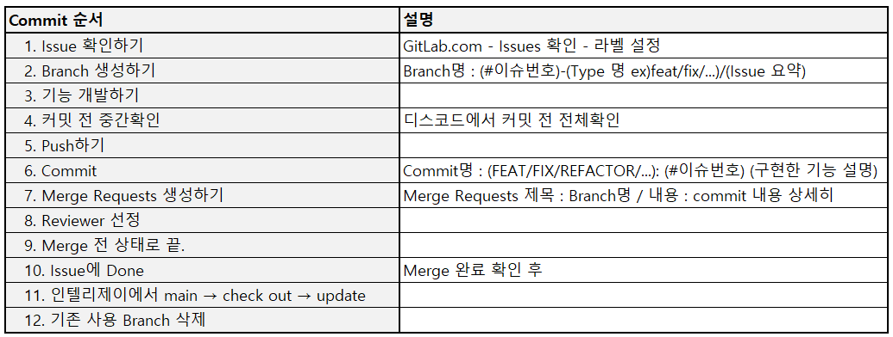

### Teamproject

# AirPlanning ✈️
**여행 플래너가 1:1 맞춤으로 계획을 세워주는 SNS입니다.**

회원가입, 로그인, 글쓰기, 별점, 채팅, 알람 등의 기능이 있습니다.
 

[📌 노션 프로젝트 페이지](https://descriptive-soda-58f.notion.site/4-Air-Planning-99a0eaa0d3584b969cffc3128a83e0a5)  
[📌 서비스 UI](http://ec2-54-180-115-200.ap-northeast-2.compute.amazonaws.com:8081/)  
[📌 Swagger-ui](http://ec2-54-180-115-200.ap-northeast-2.compute.amazonaws.com:8081/swagger-ui/)

## Index
- [프로젝트의 목적 및 용도](목적과용도)
- [개발환경](#개발환경)
- [ERD](#erd)
- [Swagger](#-swagger-)
- [API EndPoint](#-api-endpoint-)

### 🚩 프로젝트의 목적 및 용도

프로젝트에 대해 간단하게 설명하는 내용을 포함하는 것이 좋다.

- 이 프로젝트는 무엇을 위한 것인가
  -> 코로나가 조금 안정이 되며 여행의 수요가 늘어남을 파악하여 여행 계획을 짜기 어려워하는 사용자들에게 도움이 될 만한 기능을 갖춘 사이트 기획

- 어떤 문제를 해결할 수 있는가
  -> 기존의 여행사는 이미 짜여져 있는 플랜에 참여하는 방식으로 개인 별 상세한 플랜 조절이 불가능하다는 문제점이 있다.
  해외여행 관련 피해구제 신청은 지난 2014년부터 2019년 5월까지 4천651건이었다.
  대표적인 사례로는 현지 가이드의 *안내 오류 *일정 강행 *쇼핑 및 선택 관광 강요 등이 있다.

Air-Planning은 개인별 맞춤 여행 플랜이 가능하고 플래너와 사용자 간 조율을 통해 플랜을 생성하기 때문에 위의 대표적으로 문제가 되었던 사례들을 해결할 수 있을 것이다.

- 왜 이 프로젝트가 유용한가
  -> 누구나 사용자가 될 수 있고, 전문가가 아니더라도 누구나 플래너가 될 수 있기 때문에 다양하고 개성있는 계획이 많이 나올 수 있을 것이다. 누구나 가능하기에 추후 여행이 아닌 다른 분야의 플래너로 확장&개발될 수 있는 가능성도 있다.

- 어떤 사람들이 이 프로젝트를 사용하면 좋은가
  -> 여행은 가고 싶지만, 여행 준비가 어렵고, 귀찮은 사람들

### ⚙️ 개발환경
- 에디터 : Intellij Ultimate
- 개발 툴 : SpringBoot 2.7.6
- 자바 : JAVA 11
- 빌드 : Gradle
- 서버 : AWS EC2
- 데이터베이스 : MySql 8.0
- 필수 라이브러리 : SpringBoot Web, MySQL, Spring Data JPA, Lombok, Spring Security, JWT, Swagger

### 📃 ERD
### 💻 Swagger
http://ec2-54-180-115-200.ap-northeast-2.compute.amazonaws.com:8081/swagger-ui/
### ❗ API EndPoint

### ☑️ 체크리스트
✅ Gitlab CI/CD 구축 및 Swagger 추가

    - AWS

✅ 회원가입 / 로그인

    - 회원가입
        - 사용자는 다양한 서비스를 위해 회원 가입을 한다.
        - 회원가입을 위해서는 본인인증(이메일, 휴대폰)이 필요하다.
    - 로그인
        - Spring Security의 Form Login을 활용하여 구현한다.
        - 소셜(구글, 네이버, 카카오) 로그인을 지원한다.

✅ 포스트 작성 / 상세조회 / 수정 / 삭제 / 리스트

    - 포스트 작성
        - 등록된 회원만이 게시글 작성이 가능하다.
        - 등급(플래너, 일반)에 따라 작성 가능 포스트가 구분된다.
        - 로그인한 모든 사용자는 플래너 신청이 가능하다.
        - 플래너 등급은 모든 포스트작성이 가능하다.
        - 일반 등급은 등급 승인 이후 포트폴리오 등록이 가능하다.
        - 리뷰게시판은 플랜신청 기록이 있을 경우 가능하다.
    - 포스트 상세조회
        - 게시글은 테마별로 구분된다. (플래너등급신청, 플래너포트폴리오, 자유, 리뷰)
        - 등급신청 게시판은 작성자와 관리자만 열람가능하다.
        - 로그인한 사용자는 등급신청 이외의 모든 포스트의 열람이 가능하다.
    - 포스트 수정 / 삭제
        - 작성자와 관리자만 권한이 있다.

✅ 포스트 목록

    - 등록되어 있는 모든 게시글을 확인 할 수 있다.
    - 카테고리별 검색이 가능하다.
    - 한페이지에 -개의 게시글을 보여준다.
    - 화면에 -개의 페이지 수를 보여준다.
    - 최근 게시글 순으로 기본 세팅된다.

✅ 댓글 / 좋아요 / 조회수

    - 댓글
        - 로그인한 모든 사용자는 댓글 작성이 가능하다.
        - 작성자와 관리자만 수정, 삭제가 가능하다.
    - 좋아요
        - 로그인한 사용자는 게시글마다 좋아요를 누를 수 있다.
        - 게시글 당 좋아요는 한 번 가능하다.
        - 활성화 된 좋아요는 재클릭 시 취소가 가능하다.
    - 조회수
        - 게시글을 조회할 때 마다 조회수가 1씩 증가한다.

✅ 별점

    - 리뷰 포스트 작성시 필수로 입력한다.
    - 선택된 플래너의 포트폴리오 포스트의 별점에 반영한다.
    - 리뷰 포스트에 등록된 별점의 평균을 포트폴리오 포스트의 별점에 반영한다.

✅ 채팅

    - 플랜신청 수락 후 플래너와 사용자의 1:1 채팅이 가능하다.
    - 채팅이 등록된 날짜와 시간을 확인 할 수 있다.
    - 파일을 전송 할 수 있다.
    - 채팅방을 나갈 수 있다.
    - 상대방의 채팅 확인 여부가 표시 된다.
    - 새로운 채팅이 등록될 경우 알림이 표시된다.

✅ 알림

    - 플래너
        - 플랜 신청을 받았을 때
        - 리뷰가 등록 되었을 때 (선택사항)
        - 사용자로부터 1:1 채팅을 받았을 때
    - 사용자
        - 플랜신청에 대한 결과(수락/ 거절)를  등록되었을 때
        - 플래너로부터 1: 채팅을 받았을 때
        - 플래너 등급신청이 변경될 때
    - 관리자
        - 등급변경 신청이 등록되었을 때
        - 건의 사항에 대한 글이 등록 되었을 때

✅ 관리자

    - 모든 사용자의 이용 권한을 관리한다.
    - 사용자의 등급을 관리한다.
    - 모든 게시글과 댓글을 관리할 수 있다.